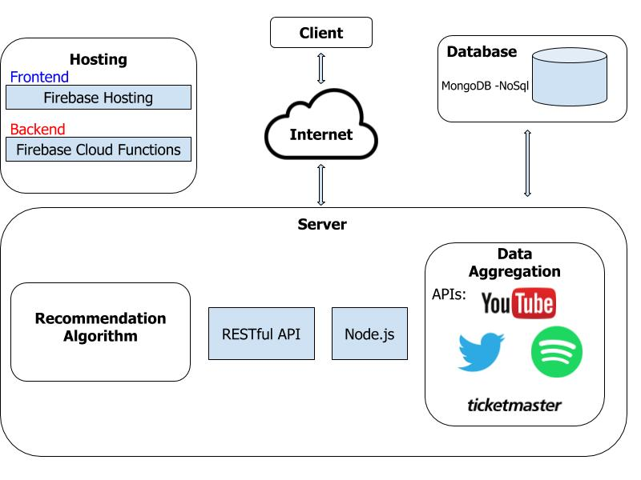

# School of Computing
# CA326 Year 3 Project
# Functional Specification

### **Project Title:** [PopFeed](https://popfeed-web-app.web.app/) 
### **Number of Students:** 2
### **Student 1 Name:** Bien Marco Jorvina &nbsp;&nbsp;&nbsp;&nbsp;&nbsp; 
### **Student 2 Name:** Draven Dale Calabia &nbsp;&nbsp;&nbsp;
### Supervisor: Michael Scriney

# Table of Contents
## 1. Introduction
* 1.1 Overview 
* 1.2 Glossary

## 2. System Architecture
* 2.1 System Architecture Diagram
* 2.2 System Architecture High-Level Overview

## 3. High-Level Design
* 3.1 System Design High-Level Overview
* 3.2 System Design High-Level Technical Overview
* 3.3 System Design Sequence Diagram Example

## 4. Problems and Resolutions
* 4.1 Issues and more issues
  
## 5. Appendices
* 5.1 Resources

# Introduction
## 1.1 Overview
The product that was developed is a web application best described as a social media **aggregator**1 and artist recommender where the users can find the latest information about musical artists/bands they like.

Artist information displayed in our product include: latest concert available on TicketMaster, concert price range, Twitter activity, YouTube content, popular album and links to the platforms mentioned. 

The product includes a user registration and login feature, enabling registered users to personalise the content displayed on their dashboard and their artist recommendations. Access to all the features of the website requires logging in using a registered user account however a ‘Guest’ account is available for use by anyone visiting the website but with limited privileges or access to features.

Since the product is a web application, its functionality extends to mobile devices featuring the web application’s responsive aspects.

The system utilises a **RESTful**2 architecture isolating the frontend components to the backend taking advantage of public **APIs**3 provided by Twitter, Spotify etc. The system architecture of the product will be discussed in the next section of this document.

## 1.2 Glossary
1. Aggregator - Aggregation is the process of grouping things together from different sources. An aggregator is a unit/component or a program which performs aggregation.

2. RESTful - Representational State Transfer (REST) is a software architectural style that defines a set of constraints to be used for creating web services. Web services that conform to the REST architectural style are called RESTful web services.

3. APIs - Application Programming Interface (API) is an interface or communication protocol allowing the communication between two applications. APIs are intended to simplify the implementation and maintenance of software. Used for web-based systems, operating systems, database systems, computer hardware or software libraries.

4. ETL - Extract, Transform, Load procedure. Data from one or more sources is extracted then copied to the data warehouse. The data extracted is transformed, converting it into the form it needs to be so that it can be placed into another database. Then the data is loaded to the target database.

5. Apriori Algorithm - algorithm for frequent item set mining and association rule learning.

6. JSON- JavaScript Object Notation.
   
# System Architecture

## 2.1 System Architecture Diagram

 <b>The diagram above illustrates the system architecture of the product.</b> 

## 2.2 System Architecture High-Level Overview
The system developed follows a **RESTful** web architecture isolating the frontend component from the backend component. The main programming language used in the development is JavaScript using Node.js.

A client is any computing device which initiates contact with our server over the internet. The client can send requests to the server to retrieve relevant information to generate the web pages. Within the server is where the data aggregation is handled from a variety of API endpoints for Spotify, Twitter, YouTube and Ticketmaster. **Extract, Transform, Load (ETL)**4 procedure is executed on the data retrieved from the APIs.

The system utilises a Data Lake where raw data extracted from the APIs are stored. The transformed data is stored is also stored into the respective databases for the pages used by the web application.

The recommendation algorithm for artists also resides in the server generating recommendation based upon the Apriori **Algorithm**5.

# 3. High-Level Design

## 3.1 System Design High-Level Overview

 <b>The diagram above illustrates the high level design of the product.</b> 

The user needs to provide registered user credentials to log into the web application. While logged in they can navigate between pages and search for artists using the search bar. Each “Click” label is the interaction between the user and the page they are on. Searching for artists will aggregate information about the artist using social media applications’ APIs. The user can log out at any moment during the interaction with the web application.

## 3.2 System Design High-Level Technical Overview

The system is separated into two components: the frontend and backend. 

The frontend component is responsible for dynamically displaying the contents of the pages to the user. The frontend receives the content to display by communicating to the backend service via RESTful API calls. User authentication is also performed via RESTful API calls to the backend.

The backend component is responsible for any calculations, data aggregation, user registration, user login authentication and database management while being isolated from direct user interaction. It is also responsible for parsing the raw JSON6 from aggregating the different APIs, extracting the information which will be used throughout the web application. The data extracted and transformed are then stored into the database.

The database utilised in the product is a NoSQL database as it best fit the requirements that we needed.

## 3.3 System Design Sequence Diagram Example

 <b>The above sequence diagram shows the optional survey process.</b> 

Web pages are dynamically generated for each artist searched using the search engine of the product. When a user searches for an artist, the server first queries the database if the information already exists, if it does then this information is retrieved and used to generate the artist page. If the data does not yet exist in the database then the server will aggregate the artist information using APIs from a variety of social media and other platforms. After aggregating the data, it is then stored into the database for future reference.

# 4. Problems and Resolutions 
## 4.1 Issues and more issues

During the development of the product progress was considerably slower at the beginning as we were getting used to the syntax of JavaScript self-learning how to achieve certain component implementations. Bottlenecked by the learning curve of the language as we develop the product, here are the issues we faced:

The first real issue encountered very early in the development of the project was achieving a responsive user interface.

1. UI Development
   * A huge feature of our web application is a clear and visually appealing User Interface. This is to give the user pleasurable user experience. Not only was the website design an issue, but we also had to take into consideration our limits into what we would and what we can’t do. We came up with many Mockup designs but were too complicated to create with react.
   * We decided to take away some unnecessary features like buttons and a recommendation box. We felt that we were doing too many things on one page. So we separate our main website functionalities into separate pages.

1. Responsiveness issue
   * The first real issue encountered very early in the development of the project was achieving a responsive user interface. We realise that our application could be used extensively as a mobile app. So making the application mobile-friendly was one of our main aims.
   * To solve this the layout of each page had to be changed. We had to be careful of what kind of data is displayed as it would break the whole website if a component size is too large. Throughout the development and design of the UI, we had to consistently test the responsiveness of any new components added in each page.

3. Lack of knowledge, experience and exception handling
   * We’re completely new to full stack web development. Due to this we didn’t know the correct procedures to complete specific tasks. We kept finding better solutions and algorithms to improve pre-existing code that worked fine. A considerable amount of time was wasted improving code than working on new aspects of the website.
   * We realised this midway in the development stage. To solve this, we bookmarked and stored the better implementations in our google drive and came back to it when we are ahead in our preliminary schedule.

4. Database
   * Very early in the development when we were following our initial functional specification much more closely we planned to develop the product using a relational database MySQL. However as we began developing and actually implementing components in the backend we quickly realised that relational database was not the correct choice for our web application.
   * We decided to utilise a non relational database NoSQL where data is stored in documents with a key and value storing system.

5. API access
   * A big aspect of the web application is being able to display relevant information about musical artists. There was a big emphasis during our functional specifications and project proposal that we will be aggregating information from the artists’ social media(s) so naturally we wanted to use pre-existing, developed and maintained APIs provided by the social media platforms. 
   * Ticketmaster and Spotify APIs were straightforward and easy to gain access to which gave a false sense of confidence in implementing more and more APIs to the backend service of the system. Soon after, we were roadblocked by Facebook and Instagram’s API policies as they restricted developers from utilising their APIs without passing the “App Review '' process. In order for any app to pass the “App Review” process the app must be ready for production which didn’t fit our current status. On top of the API restrictions the Facebook state that “App Review” could take anywhere from 5 days to weeks, time which we didn’t have.
   * To try to solve this issue specifically with Facebook and Instagram APIs we tried to look for alternative APIs which would allow us to indirectly interact and retrieve data from Facebook and Instagram. Unsuccessfully finding a solution left us with no choice but to not include Facebook and Instagram in our final  product and move on to implementing other social media platforms to the system.

6. Hosting
   * Our proposed and first attempt at hosting our components on the web was with Google Cloud Platform’s App Engine service. However, after a few failed attempts at hosting using the App Engine service we decided to look for alternatives.
   * After failing fast we had more time to try other solutions which eventually led us to using Firebase Hosting and Firebase Cloud Functions. Successfully configuring our components means that we were able to host and monitor our web application on the web for free.

7. Recommender Functionality
   * With the slow but steady progress of the web application, we were left with little time to implement the recommender functionality. Looking more into the potential solutions for the recommender algorithm we have come to a conclusion that it will be impossible to deliver the product with a song recommender system as it would require more time to implement.
   * We have decided to still implement a much more achievable recommendation system for artists instead of songs.

# 5. Appendices
## 5. 1 Resources

* Authentication
   1. https://medium.com/createdd-notes/starting-with-authentication-a-tutorial-with-node-js-and-mongodb-25d524ca0359
   2. https://github.com/Createdd/Writing/blob/master/2017/articles/AuthenticationIntro.md#what-i-will-use-for-this-introduction
* API
   * Getting Started
      1. https://www.youtube.com/watch?v=ecT42O6I_WI
      2. https://www.youtube.com/watch?v=4UoUqnjUC2c
   * Ticketmaster
      1. https://developer.ticketmaster.com/
  * Facebook
      1. https://developers.facebook.com/docs/graph-api/overview/
      2. https://developers.facebook.com/docs/plugins/embedded-posts/   
      3. https://developers.facebook.com/docs/graph-api/reference/v6.0/page/feed
      4. https://developers.facebook.com/docs/apps/review/feature/#reference-PAGES_ACCESS
   * Twitter
      1. https://developer.twitter.com/en.html
      2. https://developer.twitter.com/en/docs/twitter-for-websites/overview
      3. https://developer.twitter.com/en/docs/twitter-for-websites/timelines/overview
   * Spotify
      1. https://developer.spotify.com/documentation/web-api/libraries/#web-api-tutorial
      2. https://developer.spotify.com/documentation/general/guides/authorization-guide/#authorization-code-flow
   * Instagram
      1. https://developers.facebook.com/docs/instagram-basic-display-api
      2. https://developers.facebook.com/docs/instagram-api/
   * YouTube
      1. https://developers.google.com/youtube/v3?authuser=1
      2. https://developers.google.com/youtube/v3/docs/channels?authuser=1#resource-representation
      3. https://developers.google.com/youtube/v3/docs/search?authuser=1
  * Hiding API Keys
      1. https://www.youtube.com/watch?v=NpWWOS-tC5s
* Hosting
   1. https://www.hostgator.in/blog/how-to-host-a-website-a-complete-guide-for-beginners/
   2. https://cloud.google.com/solutions/websites
